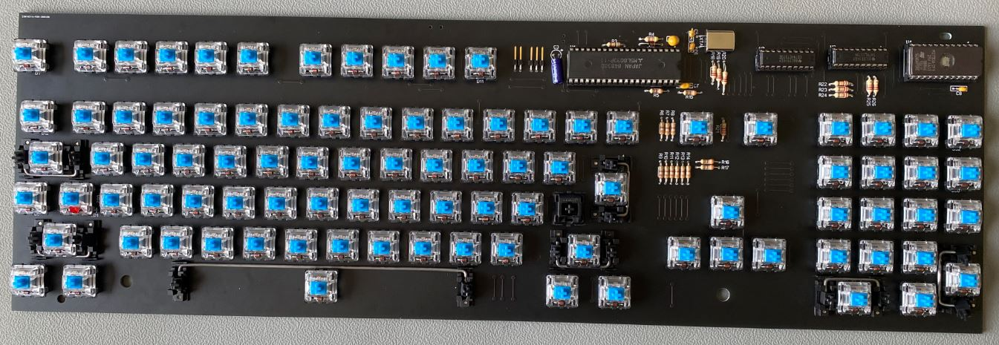
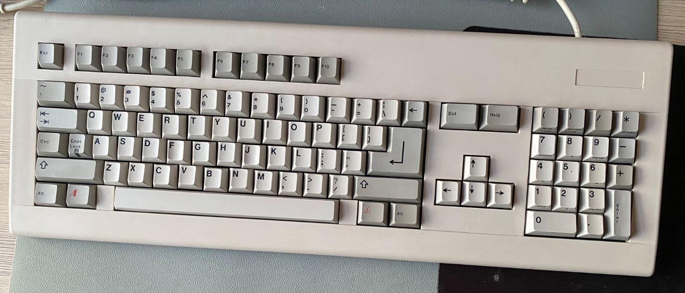

# a2000Keyboard
## Amiga 2000 Mechanical Keyboard Clone

This project aims to create an Open Source Amiga 2000 keyboard. It is based on an Amiga 2000 Cherry keyboard. 

https://deskthority.net/wiki/Commodore_Amiga_2000

The PCB was cloned by Robert ( Peepo ) Taylor and TheBrew. Robert Taylor has kindly agreed to Open Source the Gerber files which he created. 

Once Printed and built, the PCB looks like this example. This one was built using Gateron Blue Switches. 

The reconstructed keyboard looks like this:

## Project phases

1. Clone PCB and build a clone keyboard from new components
2. Work out what mods need to be made to the PCB in order to support using keycaps from WASD's keycap printing service.

3. Print a modded PCB and build a keyboard with it and WASD keycaps. 
4. Find a way of producing a case. 

Stage 1 is completed. We are currently at stage 2. 

## Repo Contents

The Gerber files for the keyboard are in the zip file: **Cherry_v2_Gerbers.zip**. Intially these Gerber files are for a clone of the original PCB only. They will be useful to you only if you wish to replace the PCB on your existing Cherry A2000 keyboard. Once the mods for WASD keycaps have been identified and made then there will likely be two sets of Gerber files. 

The ROM images are in the romImages directory. You will need to burn these to an EPROM using a ROM burner such as a TL866II Plus. Use Intel 2732A @DIP24 as the IC type.

The WASD Keycap templates will need to be uploaded to WASD's keycap printing service. They are located in the wasdKeycapTemplates directory. WASD requires that you convert objects to paths before you upload the file. This process is analogous to compiling a source file. Once this has been done, no further edits are really possible. For that reason, I have included two directories. toEdit contains templates which can be editted and toUpload contains the same files post conversion, which can be uploaded to WASD. There is also a markdown file in this directory, detailing the process to get some keycaps printed. 

Currently I have only added the US layout, seeing as this is the layout of the keyboard which was cloned. If you wish to add a regional keyboard, for example, UK or Norway, then please do so and raise a Pull Request, I will be happy to approve. 

a2000CherryBOM.xlsx is the Bill Of Materials for this project. If you just wish to build a new PCB to replace a damaged PCB in an existing A2000 Cherry keyboard then you will not need all of the items in the Bill Of Materials. In fact, you will likely need only items from the first tab "From Mouser". You should be able to upload the BOM to Mouser using their import BOM tool. 

https://www.mouser.co.uk/bom/

