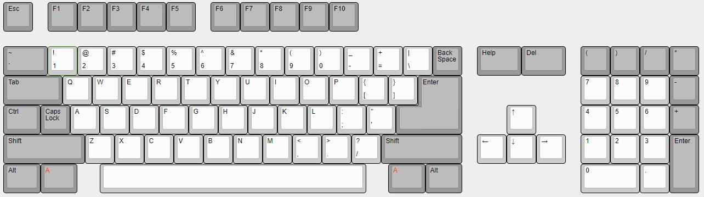
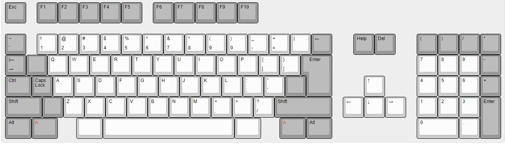
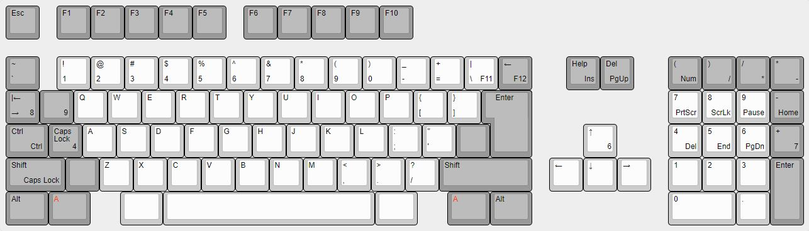
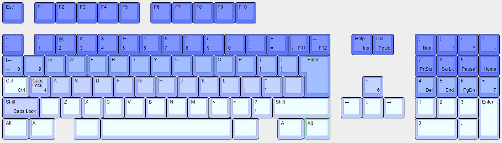

# Keyboard Layouts
Keyboard Layout Editor was used to design the keyboard layouts for this project. It provides a simple way to design Keyboard layouts. Output files are JSON. These can be uploaded and downloaded to the website.

http://www.keyboard-layout-editor.com/

The JSON files for the keyboard layouts are located in this directory. 

a2000-cherry-keyboard-original.json - provides the layout of the original keyboard, from which the clone was created. 

a2000-wasd-keycaps-v2.json - shows what the keyboard looks like after the necessary mods have been applied to make it compatible with WASD printed keycaps.

a2000-wasd-keycaps-with-from-keys-v2.json - is the same as above, with the exception that is also shows where the key is from on the WASD colour template / standard PC keyboard. For example 7 -> Numpad +, 4 -> Caps Lock. 

Finally, the file: a2000-wasd-row-profiles-v2.json show a colour gradient picture of the row profiles of the keys. To be honest, the row profiles may look somewhat odd. The colour gradient will hopefully give some idea about how the row profiles will look. The standard WASD keycap profile is 1,1,2,3,4,4. I have had to move some keys between rows. 

=======