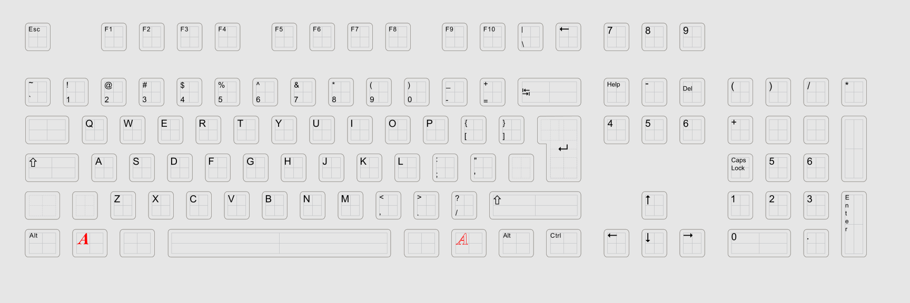
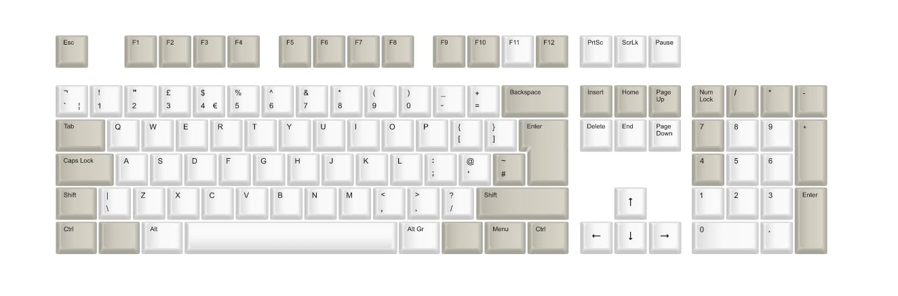
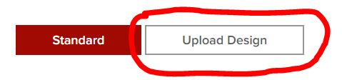
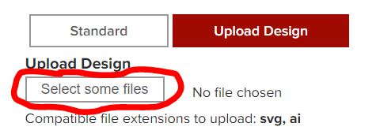
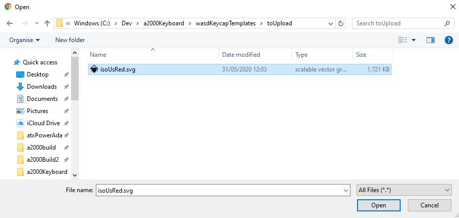
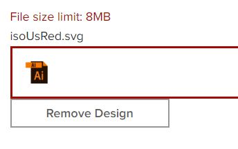
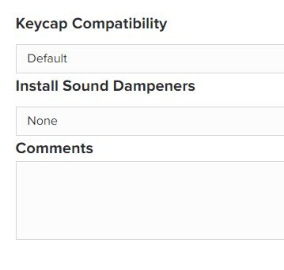
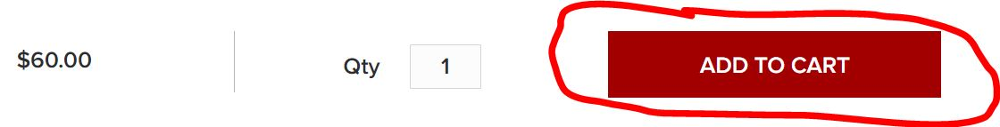

# Printing Keycaps with WASD

This readme file details the process of printing keycaps using WASD's keycap printing service. We decided to opt for using this service because it means that there is no need for any Crowd-sourcing for keycaps for this keyboard.

## Download your keycap template

First, download the file with your keycap template from the toUpload directory in this Git Project and onto your local disk, e.g. wasdKeycapTemplates/toUpload/isoUsRed.svg. You will need to upload this file to WASD later, so keep a note of it's location. 

## Register with WASD. 

[WASD Create New Customer Account]: https://www.wasdkeyboards.com/customer/account/create/

## Select 105-Key ISO Custom Cherry MX Keycap Set

[105-Key ISO Custom Cherry MX Keycap Set]: https://www.wasdkeyboards.com/105-key-iso-custom-cherry-mx-keycap-set.html

NB - ISO 105 Key layout is the closest to the original Amiga 2000 layout. It is the only option that will work.

Click On NEXT >>

## Choose colours

If you want your keycaps to look similar to the original A2000 Cherry keyboard, then use the colour map tool to choose colours using this template. 

NB - you will see here that some of the keycaps look to have the wrong colour, for example 7 and 4. This is correct. It's because these keys are actually used for other locations. 7 -> Numpad +, 4 -> Caps Lock. 

Unfortunately, WASD does not allow you to upload a colour template file currently, so you have to use the web interface to duplicate what's above. 

Click NEXT >>

## Choose Legends

Click on the Upload Design Button in WASD.

Click On Select some files

Choose the .svg template file that you downloaded in the first step above: 

You will see that your file selection has been accepted:

Click on NEXT >>

## Customise

On the next page, you can customise your WASD keycaps. However, for our purposes, we do not need to any further customisations. Leave all the items unchanged as follows: 

Click on "ADD TO CART"

## Checkout and Pay

That's it. You just need to pay for your keycaps. Cost is $60 at the time of writing plus P & P. 